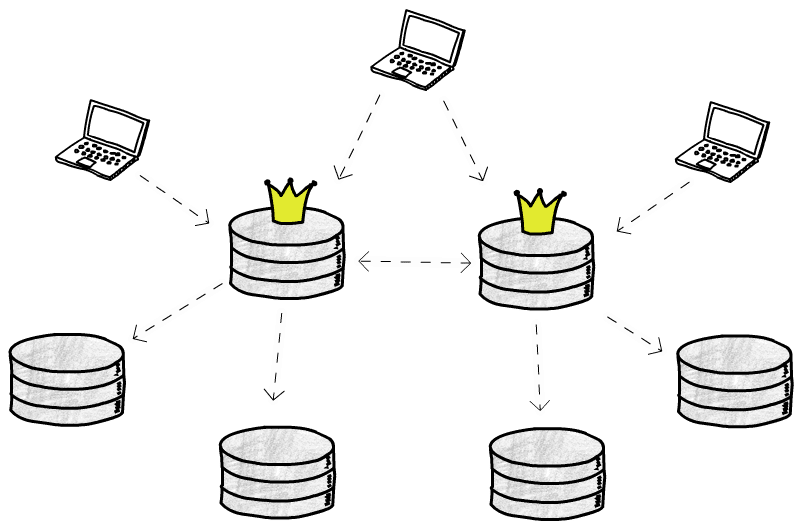
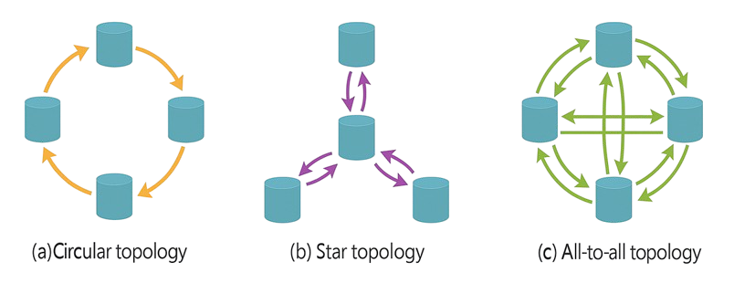

# Multi-Leader Replication with Golang

---

## Как собрать и запустить Node/CLI

Проект имеет структуру монорепозитория с двумя основными пакетами: `node` и `cli`. Папка `cmd` содержит исполняемые
файлы для обоих компонентов.
Для получения бинарных файлов `node` и `cli`, выполните следующие команды в нужной директории:

```bash
go build
# Запуск узла
./node -id=<ID> -host=<HOST> -port=<PORT>
# Запуск CLI
./cli
```


---

## Краткая архитектура

- **Node**: Основной компонент, который реализует функциональность узла в кластере. Он обрабатывает запросы на чтение и
  запись, а также взаимодействует с другими узлами для репликации данных.
  Нет разделения на leader/follower внутри узла, так как роль определяется на уровне кластера. Узел может быть лидером
  или фолловером в зависимости от конфигурации кластера.

`cmd/node` содержит код для запуска узла. <br>
`internal/node` содержит логику обработки запросов и взаимодействия с другими узлами. <br>
`internal/protocol` содержит код для сетевого взаимодействия между узлами, включая сериализацию/десериализацию сообщений
и обработку протокола репликации. <br>
`internal/inmemory` содержит реализацию in-memory хранилища для данных и дедупликации.

- **CLI**: Командная строка для управления кластером. Позволяет добавлять узлы, настраивать репликацию, устанавливать
  роль для узла и выполнять операции чтения/записи/дампа.

`cmd/cli` содержит код для запуска CLI. <br>
`internal/cli` содержит логику обработки команд и взаимодействия с узлами.
<div style="text-align: center;">
  
</div>

---


## Спецификация протокола

Взаимодействие между CLI и узлами, а также между самими узлами, выполняется поверх **TCP**.

Формат сообщений — **JSON Lines**:
- каждое сообщение — это один JSON-объект;
- объект сериализуется в одну строку;
- строка завершается символом `\n`.

Каждое сообщение обязательно содержит поле:

```json
{
  "type": "MESSAGE_TYPE"
}
```

### CLIENT_PUT_REQUEST
```json
{
  "type": "CLIENT_PUT_REQUEST",
  "request_id": "uuid",
  "client_id": "uuid",
  "key": "string",
  "value": "string"
}
```

### CLIENT_GET_REQUEST
```json
{
  "type": "CLIENT_GET_REQUEST",
  "request_id": "uuid",
  "client_id": "uuid",
  "key": "string"
}
```

### CLIENT_DUMP_REQUEST
```json
{
  "type": "CLIENT_DUMP_REQUEST",
  "request_id": "uuid",
  "client_id": "uuid"
}
```

### CLIENT_PUT_RESPONSE
```json
{
  "type": "CLIENT_PUT_RESPONSE",
  "request_id": "uuid",
  "node": {
    "node_id": "string",
    "hostname": "string",
    "port": "int",
    "role": "master | follower"
  },
  "status": "OK | ERROR",
  "error_code": "Optional[NOT_LEADER | TIMEOUT | BAD_REQUEST | UNKNOWN_NODE]",
  "error_msg": "Optional[string]"
}
```


### CLIENT_GET_RESPONSE
```json
{
  "type": "CLIENT_GET_RESPONSE",
  "request_id": "uuid",
  "node": {
    "node_id": "string",
    "hostname": "string",
    "port": "int",
    "role": "master | follower"
  },
  "status": "OK | ERROR",
  "result": {
    "value": "string",
    "version": {
      "lamport": "int",
      "node_id": "string"
    }
  },
  "found": "bool",
  "error_code": "Optional[NOT_LEADER | TIMEOUT | BAD_REQUEST | UNKNOWN_NODE]",
  "error_msg": "Optional[string]"
}
```

### CLIENT_DUMP_RESPONSE
```json
{
  "type": "CLIENT_DUMP_RESPONSE",
  "request_id": "uuid",
  "node": {
    "node_id": "string",
    "hostname": "string",
    "port": "int",
    "role": "master | follower"
  },
  "status": "OK | ERROR",
  "dump": {
    "<key1>": {
      "value": "string",
      "version": {
        "lamport": "int",
        "node_id": "string"
      }
    },
    "<key2>": {
      "value": "string",
      "version": {
        "lamport": "int",
        "node_id": "string"
      }
    }
  },
  "error_code": "Optional[NOT_LEADER | TIMEOUT | BAD_REQUEST | UNKNOWN_NODE]",
  "error_msg": "Optional[string]"
}
```

### REPL_PUT
```json
{
  "type": "REPL_PUT",
  "operation_id": "uuid",
  "node": {
    "node_id": "string",
    "hostname": "string",
    "port": "int",
    "role": "master | follower"
  },
  "key": "string",
  "value": "string",
  "version": {
    "lamport": "int",
    "node_id": "string"
  }
}
```

### REPL_ACK
```json
{
  "type": "REPL_ACK",
  "operation_id": "uuid",
  "node": {
    "node_id": "string",
    "hostname": "string",
    "port": "int",
    "role": "master | follower"
  }
}
```

### CLUSTER_UPDATE_REQUEST
```json
{
  "type": "CLUSTER_UPDATE_REQUEST",
  "request_id": "uuid",
  "nodes": {
    "<nodeId>": {
      "node_id": "string",
      "hostname": "string",
      "port": "int",
      "role": "master | follower"
    }
  },
  "next_masters": {
    "<masterNodeId>": [
      {
        "node_id": "string",
        "hostname": "string",
        "port": "int",
        "role": "master"
      }
    ]
  },
  "followers": {
    "<masterNodeId>": [
      {
        "node_id": "string",
        "hostname": "string",
        "port": "int",
        "role": "follower"
      }
    ]
  },
  "min_delay_ms": "int",
  "max_delay_ms": "int"
}
```

### CLUSTER_UPDATE_RESPONSE
```json
{
  "type": "CLUSTER_UPDATE_RESPONSE",
  "request_id": "uuid",
  "node": {
    "node_id": "string",
    "hostname": "string",
    "port": "int",
    "role": "master | follower"
  },
  "status": "OK | ERROR",
  "error_code": "Optional[NOT_LEADER | TIMEOUT | BAD_REQUEST | UNKNOWN_NODE]",
  "error_msg": "Optional[string]"
}
```

---


## Lamport Clock

В multi-leader режиме каждый узел поддерживает локальные логические часы Lamport:

```text
lamportCounter: int
```

Lamport Clock нужен для того, чтобы присваивать операциям версии, которые можно одинаково сравнивать на всех узлах без использования физического времени.

### Правила обновления Lamport Clock

#### 1. Локальный `PUT` на master-узле
Когда master-узел принимает клиентскую запись:
1. увеличивает локальный счётчик:
   ```text
   L := L + 1
   ```
2. создаёт версию записи:
   ```text
   version := (L, currentNodeId)
   ```

Именно эта версия записывается в локальное хранилище и затем распространяется по репликации.

#### 2. Получение репликационной операции
Когда узел получает `REPL_PUT` с версией:

```text
(remoteLamport, remoteNodeId)
```

он обновляет свои логические часы по правилу:

```text
L := max(L, remoteLamport) + 1
```

Важно:
- это обновляет локальные часы узла;
- при применении репликации в хранилище сохраняется именно пришедшая версия, а не новая локальная версия.

То есть Lamport Clock используется для поддержания локального порядка событий, но версия реплицируемого значения не должна переписываться на каждом хопе.

### Почему Lamport значения могут совпадать

Одинаковые значения `lamport` в multi-leader системе — это нормальный сценарий.

Например:
- у leader `A` локальный счётчик равен `5`;
- у leader `B` локальный счётчик тоже равен `5`;
- почти одновременно оба принимают `PUT` одного и того же ключа;
- оба увеличивают счётчик до `6`.

В результате появляются две разные версии:

```text
(6, A)
(6, B)
```

Поэтому одного поля `lamport` недостаточно — при равенстве требуется дополнительное правило tie-break по `nodeId`.

### Правило сравнения версий

Каждое значение в хранилище имеет версию вида:

```text
version = (lamport, nodeId)
```

Где:
- `lamport` — значение Lamport Clock на момент создания версии;
- `nodeId` — идентификатор узла, создавшего эту версию.

Для разрешения конфликтов используется детерминированное сравнение версий по правилу **LWW (Last Write Wins)**.

### Версия считается новее, если:
1. у неё больше `lamport`;
2. если `lamport` одинаковый — больше `nodeId` в лексикографическом порядке.

Формально:

```text
(l1, n1) > (l2, n2)
если
l1 > l2
или
l1 == l2 && n1 > n2
```

### Применение версии в хранилище

При получении новой версии для ключа:
- если ключа ещё нет — сохранить значение;
- если `incoming.version > local.version` — заменить локальное значение;
- иначе — проигнорировать входящую версию.

То есть логика применения выглядит так:

```text
if key does not exist:
    store incoming value
else if incoming.version > local.version:
    replace local value
else:
    ignore incoming value
```

### Что это даёт

Если прекратить новые записи и дать репликации завершиться, все узлы в итоге приходят к одному и тому же состоянию по каждому ключу.

Именно детерминированное правило сравнения версий гарантирует eventual consistency в присутствии конфликтующих записей от нескольких leader-узлов.

---

## Топологии репликации

<div style="text-align: center;">
  
</div>

В multi-leader режиме путь распространения обновлений определяется текущей топологией. CLI формирует граф распространения и рассылает его узлам через `CLUSTER_UPDATE`. Узлы далее используют этот граф при форвардинге `REPL_PUT`.

В текущей реализации используются три топологии:
- `mesh`
- `ring`
- `star`

### Mesh

В топологии `mesh` каждый master-узел знает все остальные master-узлы.

Это означает, что при появлении новой операции master может отправить `REPL_PUT` сразу всем другим master-узлам. Такая схема даёт широкое и быстрое распространение обновлений, но создаёт больше сетевого трафика.

Схема связности для master-узлов:

```text
master -> all other masters
```

### Ring

В топологии `ring` master-узлы образуют логическое кольцо.

Порядок master-узлов строится детерминированно — по отсортированным `nodeId`. После этого каждый master знает только одного следующего соседа в кольце.

Схема связности для master-узлов:

```text
master[index] -> master[(index + 1) % N]
```

### Star

В топологии `star` выбирается центральный master-узел — `star center`.

Все остальные master-узлы взаимодействуют через него:
- если обновление возникло на нецентральном master-узле, оно сначала идёт в центр;
- центр затем пересылает его остальным master-узлам;
- если обновление возникло на центре, он сразу рассылает его остальным master-узлам.

Схема связности для master-узлов:

```text
non-center master -> center
center -> all other masters
```
### Репликация на follower-узлы

Помимо master-to-master графа, CLI также задаёт отображение `master -> followers`.

Follower-узлы не принимают клиентские `PUT`, но получают репликацию от назначенного master-узла. В текущей реализации follower-узлы распределяются между master-узлами по схеме round-robin.

Это означает:
- у каждого master есть список закреплённых за ним follower-узлов;
- после обработки записи master дополнительно распространяет обновление в своих follower-узлов;
- follower применяет пришедшую версию и отправляет `REPL_ACK`.

### Итог

Таким образом:
- `mesh` минимизирует время схождения ценой большего сетевого трафика;
- `ring` уменьшает число прямых отправок, но увеличивает число хопов;
- `star` упрощает маршрут распространения, но делает центральный узел SPOF.

Выбранная топология напрямую влияет на путь `REPL_PUT`, сетевую нагрузку и время схождения к eventual consistency.

---

## Как запускать бенчмарки

Бенчмарки находятся в папке `benchmarks`. После прогонов бенчмарков, результаты будут сохранены в файлах `resultsA.csv`, `resultsB.csv` и `resultsC.csv` в той же директории.
Там же находится файл `report.md` с анализом результатов и графиками. Для запуска используйте команду:

```bash
python3 benchmark.py
```

---