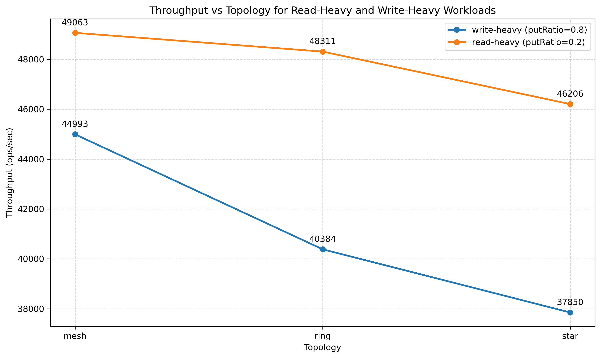
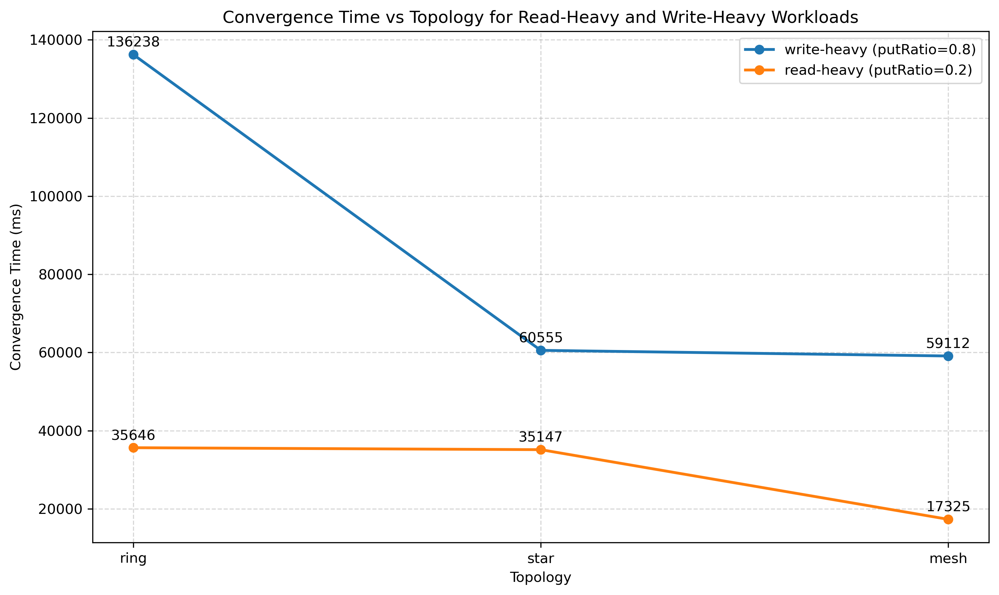
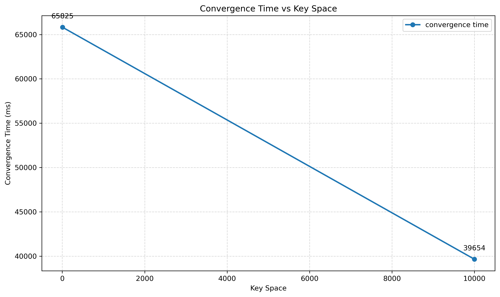
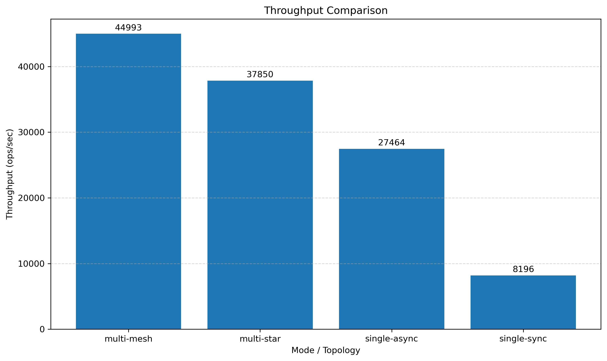
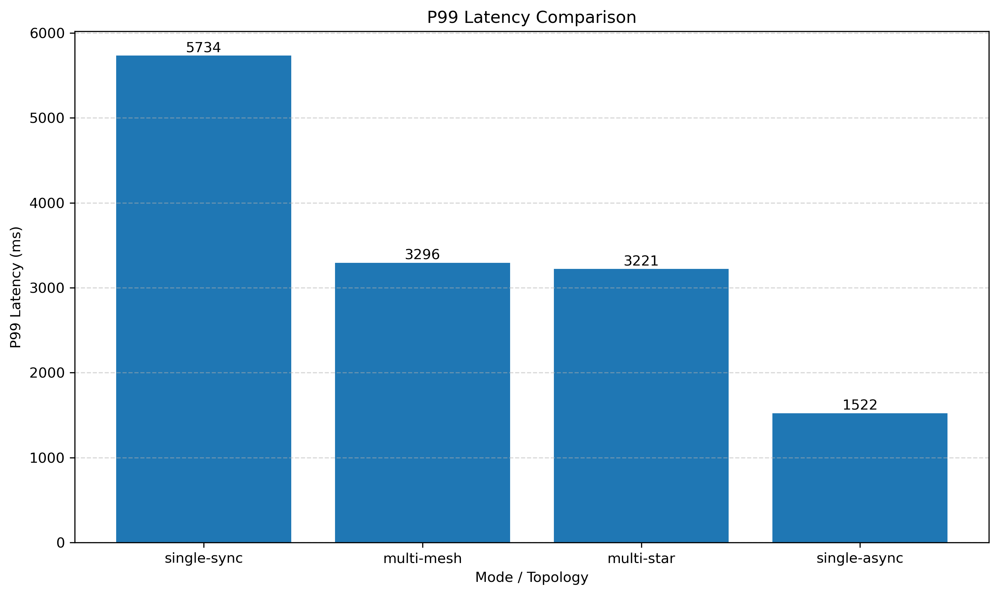

# Benchmark report

## 1. Все прогоны

### 1.1 Multi-leader: сравнение топологий

| topology | threads | putRatio | totalOps | keySpace | throughputOpsSec |    avgMs |    p50Ms |    p75Ms |    p95Ms |    p99Ms | convergenceTimeMs |
|----------|--------:|---------:|---------:|---------:|-----------------:|---------:|---------:|---------:|---------:|---------:|------------------:|
| mesh     |      16 |      0.8 |   200000 |    10000 |        44992.529 | 1902.651 | 1808.310 | 2211.800 | 3006.490 | 3295.771 |             59112 |
| mesh     |      16 |      0.2 |   200000 |    10000 |        49062.854 | 2070.694 | 1966.695 | 2532.556 | 3367.175 | 3777.156 |             17325 |
| ring     |      16 |      0.8 |   200000 |    10000 |        40383.715 | 1909.864 | 1826.868 | 2251.450 | 3051.949 | 3321.106 |            136238 |
| ring     |      16 |      0.2 |   200000 |    10000 |        48310.867 | 2075.290 | 1910.219 | 2548.583 | 3328.307 | 3646.023 |             35646 |
| star     |      16 |      0.8 |   200000 |    10000 |        37850.243 | 1904.355 | 1848.050 | 2208.682 | 2924.778 | 3220.595 |             60555 |
| star     |      16 |      0.2 |   200000 |    10000 |        46205.779 | 2145.153 | 2054.212 | 2632.931 | 3298.907 | 3620.341 |             35147 |

### 1.2 Multi-leader: сравнение по key-space

| topology | threads | putRatio | totalOps | keySpace | throughputOpsSec |    avgMs |    p50Ms |    p75Ms |    p95Ms |    p99Ms | convergenceTimeMs |
|----------|--------:|---------:|---------:|---------:|-----------------:|---------:|---------:|---------:|---------:|---------:|------------------:|
| mesh     |      16 |      1.0 |   100000 |        5 |        31562.231 | 1092.462 | 1024.087 | 1296.667 | 1654.389 | 1802.058 |             65825 |
| mesh     |      16 |      1.0 |   100000 |    10000 |        33566.816 | 1206.487 | 1119.408 | 1392.984 | 1784.673 | 1910.338 |             39654 |

### 1.3 Single-leader vs multi-leader: прямое сравнения

| mode          | config      | throughputOpsSec |    p99Ms |
|---------------|-------------|-----------------:|---------:|
| single-leader | sync, RF=3  |         8195.818 | 5733.569 |
| single-leader | async, RF=1 |        27463.966 | 1522.232 |
| multi-leader  | mesh        |        44992.529 | 3295.771 |
| multi-leader  | star        |        37850.243 | 3220.595 |

---

## 2. Графики

### 2.1 График throughput vs topology

### 2.2 График convergence time vs topology

### 2.3 График  convergence time vs key space

### 2.4 График сравнения throughput: single-leader vs multi-leader

### 2.5 График сравнения p99 latency: single-leader vs multi-leader

---

## 3. Краткое объяснение результатов

### 3.1 Почему multi-leader даёт несколько точек записи, но создаёт конфликты

В multi-leader репликации несколько узлов могут одновременно принимать записи. Это улучшает доступность записи и может
увеличить общий throughput, потому что клиентам не нужно отправлять все write-запросы только на одного центрального мастера.
Однако если разные мастера одновременно изменяют один и тот же ключ, реплики могут получить конфликтующие версии в разном
порядке. Из-за этого системе требуется дополнительная логика разрешения конфликтов: например, Lamport timestamp и LWW.

### 3.2 Почему mesh обычно быстрее по схождению, но дороже по сети

В topology mesh узлы имеют прямые связи со всеми остальными узлами. Поэтому обновления могут
распространяться напрямую, без большого числа промежуточных хопов, и система обычно сходится быстрее. Это видно и в
экспериментах: mesh показывает лучшее время схождения среди multi-leader топологий. 
Но за это приходится платить сетевой стоимостью, больше соединений, которые нужно поддерживать, больше репликационных сообщений.

### 3.3 Почему ring медленнее и чувствителен к разрыву

В ring-топологии обновления передаются по соседям, шаг за шагом. Из-за этого запись часто должна пройти несколько хопов,
прежде чем станет известна всей системе. Это делает схождение медленнее, чем в других топологиях, где нужно меньшее число хопов.
Это видно и по результатам: ring показывает худшее время схождения. 
Кроме того, ring чувствителен к отказам узлов или разрыву связей. Если одна часть кольца ломается, пути репликации
вообще становятся разорваными. Поэтому ring прост по
структуре, но платит за эту простоту более медленным распространением обновлений и худшей устойчивостью к отказам.

### 3.4 Почему star создаёт bottleneck

В topology star есть центральный узел, через который проходит значительная часть коммуникации. Это упрощает
маршрутизацию, но именно этот центр становится естественным bottleneck: через него проходит слишком много сообщений, 
он может перегружаться, throughput и latency начинают сильно зависеть от производительности одного узла.

### 3.5 Где выигрывает single-leader, а где multi-leader

#### Single-leader выигрывает, когда:

- важен строгий порядок записи;
- система не терпит конфликтов;
- предпочтительнее централизованная координация.

#### Multi-leader выигрывает, когда:

- системе нужно несколько точек записи;
- важен высокий суммарный write throughput;
- запись должна быть распределена между несколькими узлами.

### 3.6 Интерпретация полученных графиков

#### Throughput vs topology

И для write-heavy, и для read-heavy нагрузки topology mesh показывает лучший throughput, ring находится посередине, а
star даёт худший результат. Это обосновано тем, что:

- mesh выигрывает за счёт прямой коммуникации;
- ring платит за дополнительные хопы;
- star упирается в центральный bottleneck.

#### Convergence time vs topology

Mesh сходится быстрее всего, ring - медленнее всего, star - между ними. Это полностью соответствует структуре топологий:

- в mesh обновления расходятся напрямую;
- в star многое зависит от центра;
- в ring распространение идёт последовательно через всех соседей.

#### Convergence time vs key space

В предоставленном прогоне больший `keySpace` дал меньшее время схождения. Это обусловлено тем, что
когда записи распределяются по большему числу ключей, система реже получает повторные конфликты и обновления по одним и
тем же данным, поэтому реплики быстрее стабилизируются.

#### Single-leader vs multi-leader

Прямое сравнение показывает:

- **максимальный throughput:** multi-mesh;
- **минимальный p99 latency:** single-async;
- **худшие throughput и p99:** single-sync.

Это хорошо иллюстрирует основной компромисс:

- **single-async** минимизирует клиентскую latency, потому что подтверждает запись до завершения репликации;
- **single-sync** даёт более сильные гарантии, но расплачивается latency и throughput;
- **multi-leader** выигрывает по throughput за счёт нескольких write-точек, но требует разрешения конфликтов и более
  сложной синхронизации.

---

## 4. Итоговый вывод

Эксперименты подтверждают ожидаемое поведение стратегий репликации и сетевых топологий.

- **Mesh** — лучшая топология по convergence time и throughput, но самая дорогая по сетевым затратам.
- **Ring** — самая медленная по convergence time и более уязвима к отказам, потому что обновления вынуждены проходить через
  промежуточные узлы.
- **Star** — проще по структуре, но центральный узел становится bottleneck.
- **Single-leader** — проще концептуально и не создаёт конфликтов, но единая точка для записи.
- **Multi-leader** — лучше масштабирует запись за счёт нескольких точек записи, но усложняет систему из-за конфликтов и
  фонового согласования.
